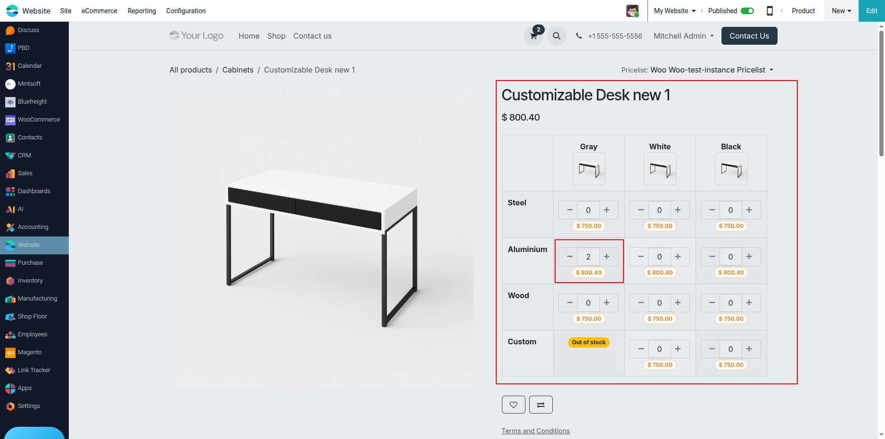
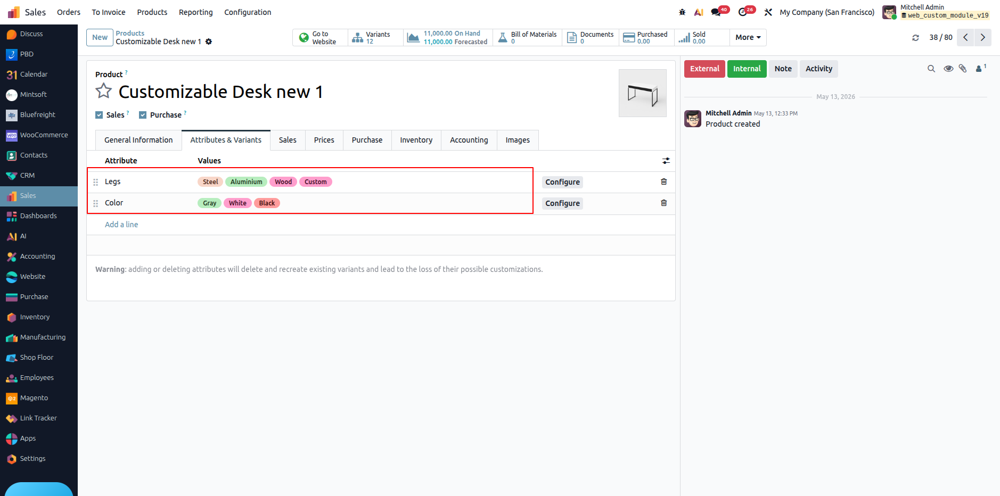

# eCommerce Products Matrix

Shows product variants as a matrix (grid) on the website product page instead of the default dropdown/radio selector, when a product has 2 or 3 variant attributes (e.g. Legs × Color, or Legs × Color × Size).

## Screenshots

**Storefront — variant matrix**

**Backend — attributes behind the matrix**

## Features

- Grid view of all variant combinations, with price and stock shown per cell.
- Quantity stepper (`-`/`+`) on each cell adds/updates the cart directly, no page reload.
- 3rd attribute (if present) splits the grid into separate sections.
- Hide a variant per website (`Website` field on the variant) or per country (`Countries` field on an attribute value).
- Cart line shows product name + SKU instead of the full variant name.

## Setup

1. Install the module.
2. On a product, add 2 or 3 attributes under **Attributes & Variants** — the matrix appears automatically on its website page.
3. Optionally set **Website** on a variant, or **Countries** on an attribute value, to restrict visibility.

## Depends on

`website`, `website_sale`, `website_sale_stock`
