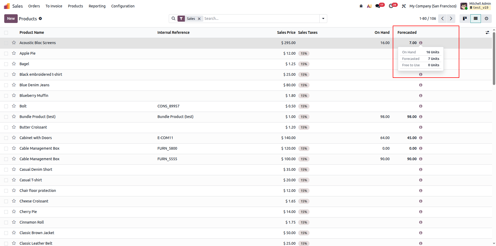
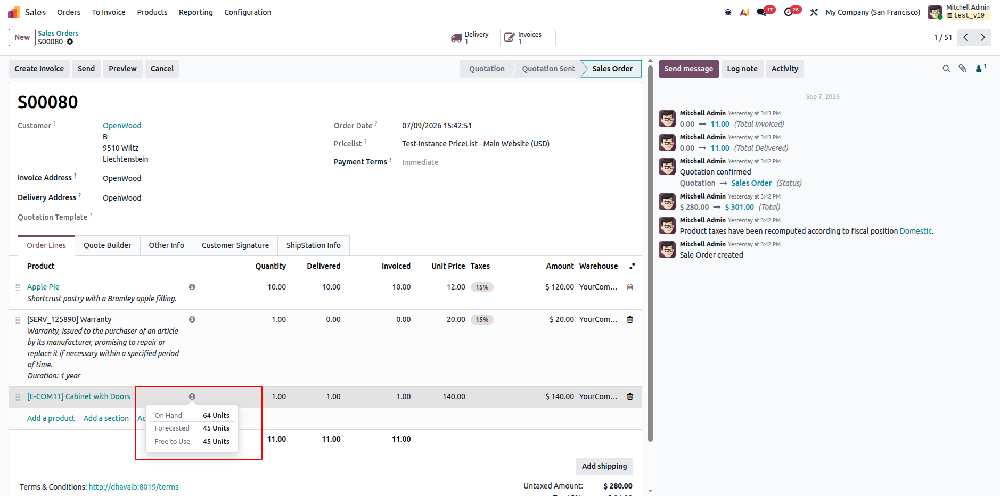
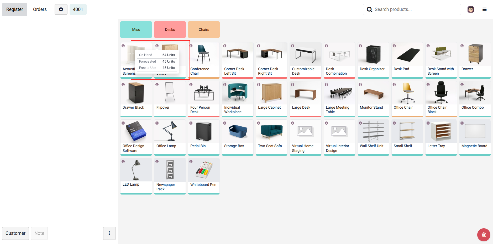

# Product Stock Info Popover

A reusable **Odoo 19** widget that adds a small **(i) info icon** next to a product. Clicking it shows a quick popover with the product's **On Hand**, **Forecasted**, and **Free to Use** quantities.

Works out of the box on:
- Sale Order lines
- Product list view
- Point of Sale (product grid + cart lines)

## Screenshots





## Features

- One shared widget reused across all views — not a separate build per screen.
- Click-to-load: quantities are fetched only when the popover opens.
- Doesn't interfere with row clicks, "add product", or "add to cart".
- Hides itself when there's no product (e.g. section/note lines).
- Warns if the product is archived; shows a friendly message if the lookup fails.
- Warehouse-aware when the view provides a warehouse field.
- Reusable on other views without code changes — just add:
  ```xml
  <widget name="stock_info_widget" options="{'product_field': 'product_id'}"/>
  ```

## How it works

- **Backend** (Sale Order lines, Product list): `get_stock_info_popover_data()` on `product.product` / `product.template` (`models/product.py`) reads `qty_available`, `virtual_available`, `free_qty` and returns them to the widget.
- **POS**: reuses Odoo's existing `pos.getProductInfo()` lookup instead of adding a new endpoint, keeping figures consistent with POS's own "Product Info" popup.

## Dependencies

`stock`, `sale`, `sale_stock`, `point_of_sale` — no third-party packages.
